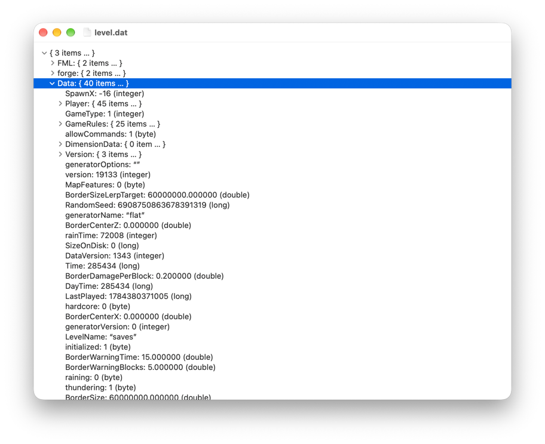

# NBT Editor



`NBT Editor` aims to be a NBT editor obviously but familiar for Windows users whose used
[NBTExplorer](https://github.com/jaquadro/NBTExplorer).

It's core, `NBTKit`, is written in Rust and Objective-C. While the GUI interface, the editor, is written in Objective-C
linking with `NBTKit`.

## Status

| Layer    | Compression | NBT            | Region        | Notes                              |
|----------|-------------|----------------|---------------|------------------------------------|
| `NBTKit` | Read-only   | Read and write | Not supported | Compressed files not yet editable  |
| GUI      | Read-only   | Read and write | Not supported | Editing not yet wired up in the UI |

Editing is fully supported at the core; only the GUI is currently read-only, viewer-first.

The app marks it-self as an opener for `dat` (compressed NBT file) and `nbt` (raw NBT file) files.

## Build instructions

NBT Editor is meant to be built only on macOS, it may not be compatible with cross-platform compilation setup (Linux
with GNU Step). It requires CMake, GNU make, Rust toolchain (nightly **and** stable) and C compiler (Clang by default on 
macOS).

```bash
$ mkdir build
$ cd build
$ cmake ..
$ make
```

Then you should find `NBTKit.framework` and `NBTEditor.app`.

## Architecture

`NBTKit` doesn't expose a traditional C FFI surface. Instead, it uses [`objc2`](https://github.com/madsmtm/objc2) to
register Objective-C methods directly into the runtime, from a constructor that runs automatically when the framework is
loaded. This keeps the exported symbol table clean — no `NBTKit_*`-style C functions — while still exposing a native
Objective-C API surface to the GUI layer.
